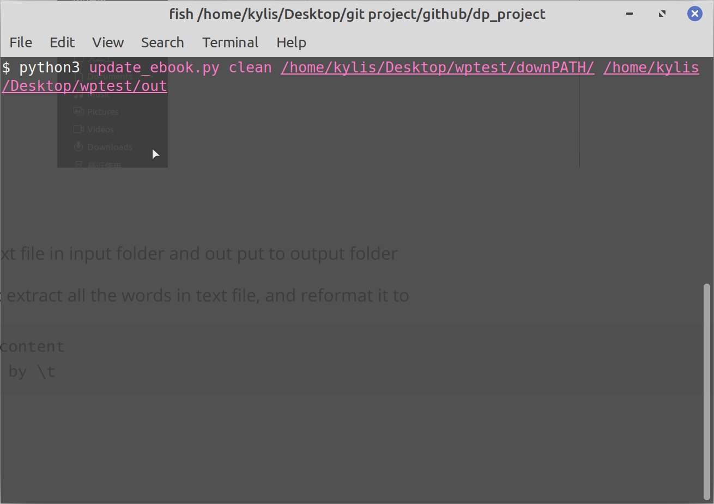

# Data processing workshop Ⅱ group project

This repository includ all code writen by Erwin(kylis) for this group project

## 1. data_collect.py

download and update English txt resourse from http://www.gutenberg.org/ebooks/search/?sort_order=release_date

### usage

please read help by following code:

```shell
python data_collect.py -h
python data_collect.py download -h
python data_collect.py update -h
python data_collect.py merge -h
python data_collect.py clean -h
```

please use update after download command !!!!

### example

pwd is “/home/kylis/Desktop/git project/github/dp_project”

#### download:


the structure of ./test folder after “download” like following screenshot:


#### update:

Before update, the latest ebook is 63938.


Update it:

```shell
python3 update_ebook.py update ./test
```

Now the latest ebbok is 63953.


#### merge:


the structure of ./test folder after “merge” like following screenshot:


### clean

clean all the text file in input folder and out put to output folder

“clean” means: extract all the words in text file, and reformat it to

```
doc_id	content
#splited by \t
```



The 64059.txt in downPATH before clean:


The 64059.txt in out folder after clean:

