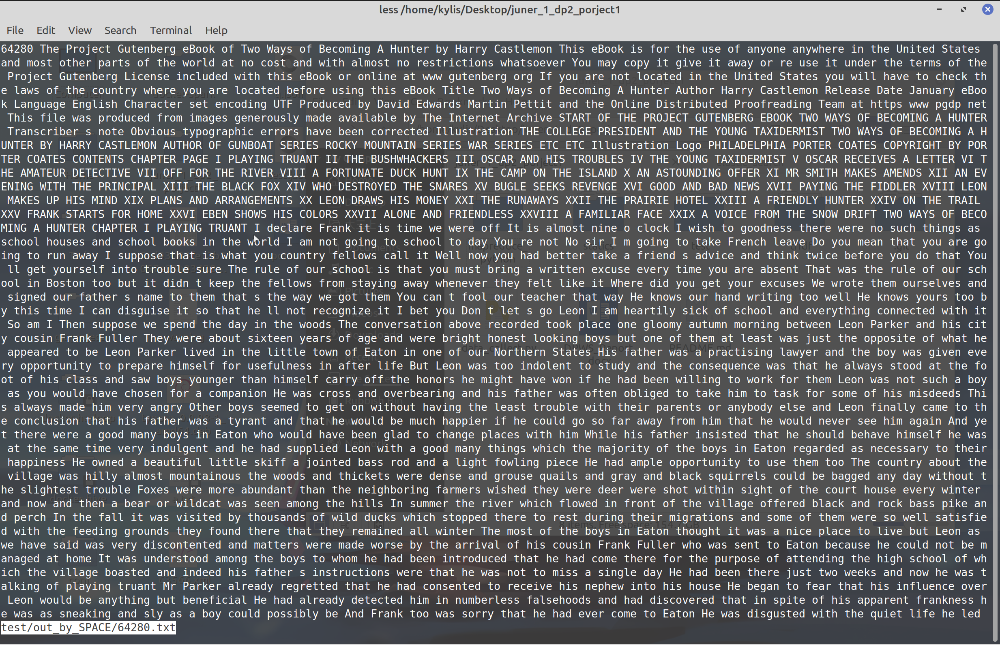

# Data processing workshop Ⅱ group project

This repository include all code written by Erwin(kylis) for this group project

## 1. data_collect.py

download and update English txt resource from http://www.gutenberg.org/ebooks/search/?sort_order=release_date

### usage

please read help by following code:

```shell
python data_collect.py -h
python data_collect.py download -h
python data_collect.py update -h
python data_collect.py merge -h
python data_collect.py clean -h
```

please use update after download command !!!!

### example

A example workflow of data collect and process

#### download:


the content in conf file means the files in localhost is from 64079 to 64094.

#### update:

we delete the 64094 and modify the conf file to “64093*64079”, than update it


#### clean:

the picture is not updated, the argument -s should be ‘SPACE’ or ‘TAB’, not ‘ ’.


the 64079.txt in downPATH is:


the 64079.txt in out_by_SPACE is:



#### merge


## TF-IDF

Check the help:

```python3
python search.py -h
```

the searched file should have format like: id\<space\>content


format: key_word,file_id tf-idf