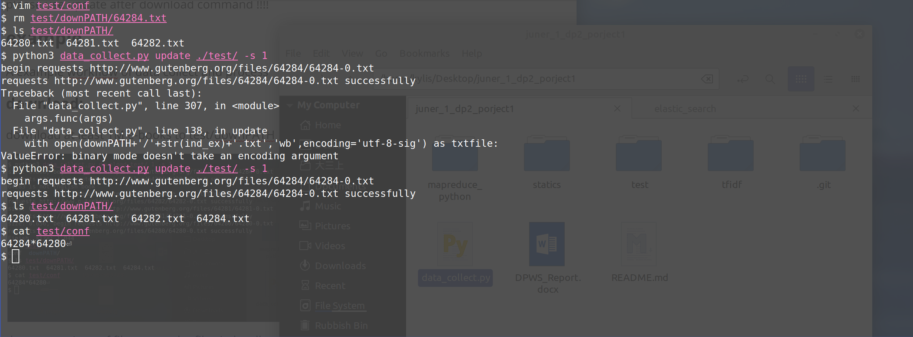

# Data processing workshop Ⅱ group project

This repository include all code written by Erwin(kylis) for this group project, if you have any problem or the code have any bugs, please contact me by wechat 13125261195 or my student email.

## 1. data_collect.py

download and update English txt resource from http://www.gutenberg.org/ebooks/search/?sort_order=release_date

### usage

please read help by following code:

```shell
python data_collect.py -h
python data_collect.py download -h
python data_collect.py update -h
python data_collect.py merge -h
python data_collect.py clean -h
python data_collect.py toxml -h
python data_collect.py x2j -h
```

please use update after download command !!!!

### example

A example workflow of data collect and process

#### download:

download at least 1M e-books to test/downPATH


the content in conf file means the files in localhost is from 64280 to 64284.

#### update:

we delete the 64284 and modify the conf file to “64283*64280”, than update it



The 64284.txt come back and the conf file retrieved.

#### clean:


the 64280.txt in downPATH is:


the 64280.txt in out_by_SPACE is:


the 64280.txt in out_by_TAB is:


#### merge


#### toxml


the xml file in test/xml


### x2j


the json file in test/json


The merged file will be used in mapreduce with python and search by TFIDF.

The xml file and json file will be used in solr and elasticsearch.

## 2. mapreduce_python

the text file should have format like: id\<TAB\>content

```shell
cat merge.txt | python3 mapper.py | sort | python3 reducer.py > result.txt
```

part of result.txt:

```
a	64060:71,64061:136,64063:71,64064:148,64068:340,64069:434,64070:1363,64071:113,64072:156,64073:248,64074:754,64075:71,64076:71,64077:187,64078:322,64079:1028,64080:71,64081:71,64082:71,64083:804,64088:698
aat	64083:1
ab	64069:3
abaco	64070:1
abaet	64068:1
abandon	64069:1,64070:2,64071:1,64083:1
abandoned	64061:1,64068:1,64069:3,64070:4,64079:1,64083:1
abandoning	64069:1,64079:1
abandonment	64068:1,64079:1
abasgians	64069:1
abashed	64083:1
abashes	64083:1
abated	64070:1
abbats	64069:1
abbey	64069:1,64079:1
```

## 3. tfidf

Check the help:

```python3
python search.py -h
```

the searched file should have format like: id\<space\>content

search.py only can run in linux who use “python3” to run python, like debian base linux.


output format: key_word,file_id tf-idf

